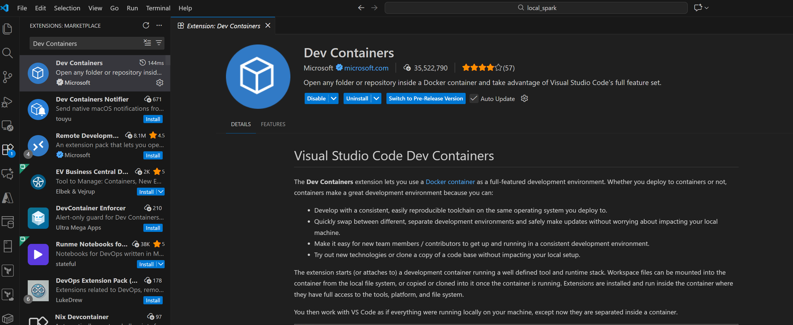
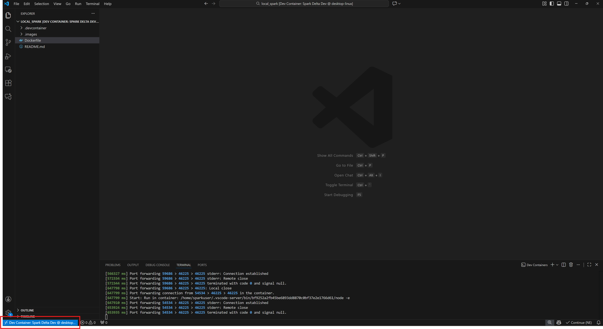
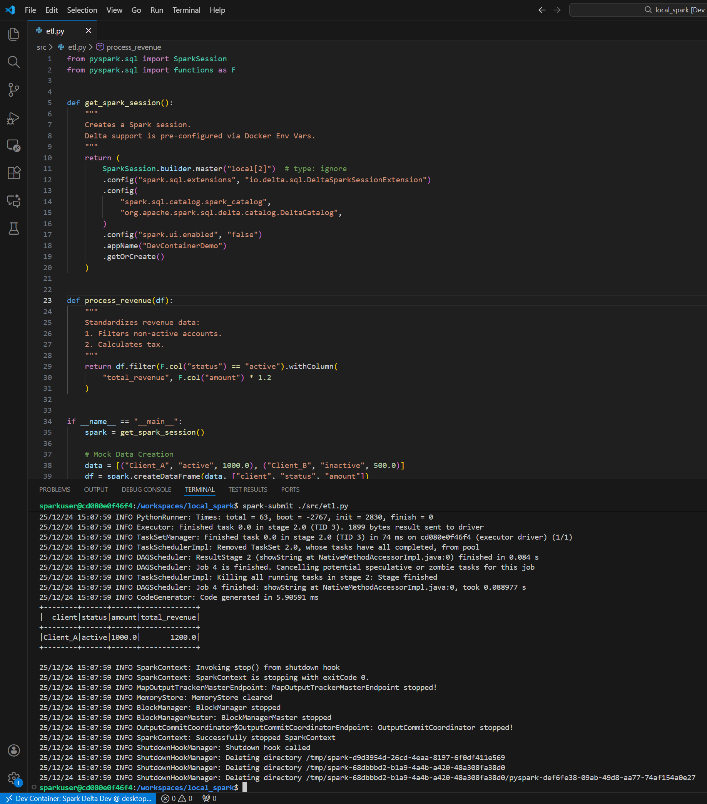
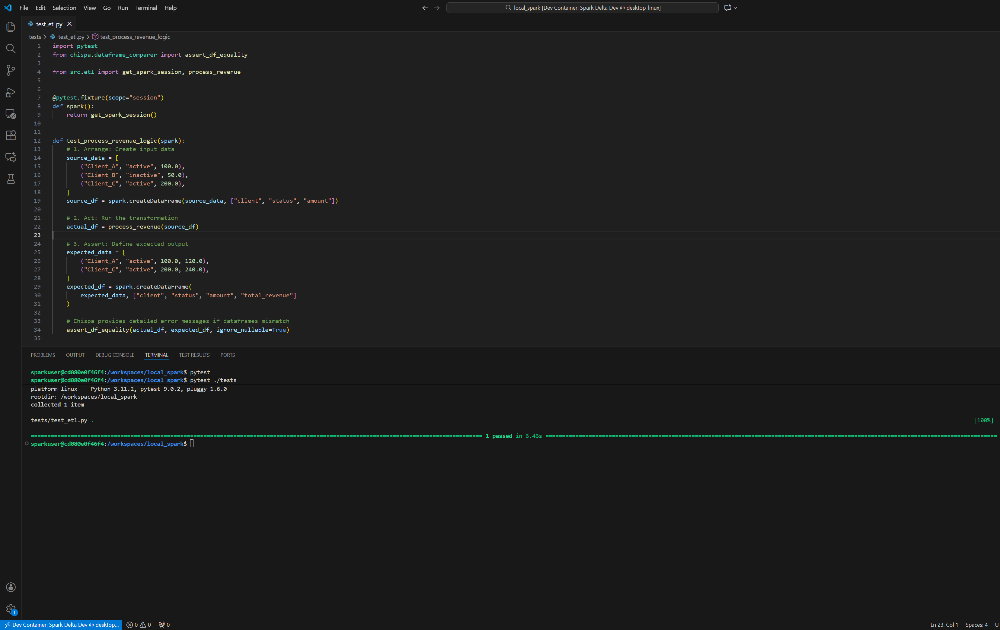
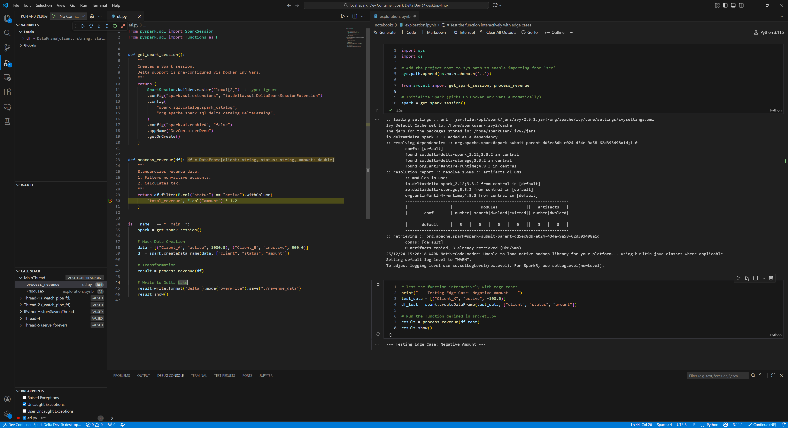
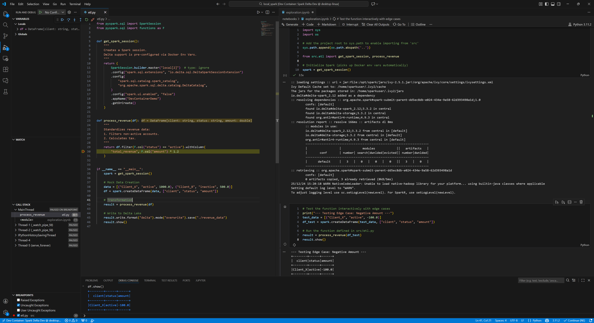

# Standardizing Data Engineering Workflows: A Guide to Local Spark Development with Docker and VS Code

### The Challenge: The Cost of Environmental Drift

In the domain of Data Engineering, the phrase "it works on my machine" represents a significant, quantifiable technical debt. Managing local development environments for Apache Spark can be complex; it requires the precise alignment of Java versions, Scala binaries, Python dependencies, and operating system libraries.

When these configurations drift between developers or diverge from production CI/CD agents, the result is lost productivity and fragile deployment pipelines. To ensure robustness and scalability, modern data teams must treat the development environment itself as code.

This article provides a technical guide to implementing a standardized, containerized development environment using **Docker** and **VS Code + Dev Containers**. We will build a custom image capable of running PySpark with Delta Lake support, demonstrate unit testing, and show how to use Jupyter Notebooks for interactive debugging.

---

### Step 1: The Foundation (The Dockerfile)

The core of this solution is a robust `Dockerfile`. We are building a Debian-based image that abstracts away the complexity of installing Spark, Hadoop, and Java.

This configuration handles **Delta Lake integration** at the build level. We define specific versions as build arguments to ensure all components talk to each other correctly.

> **Compatibility Note:** When customizing the versions below, it is critical to ensure that your Spark, Scala, and Delta Lake versions are compatible. You can verify the correct compatibility matrix on the [Delta Lake Releases page](https://delta-docs-incubator.netlify.app/releases/).

**Save the following code as `Dockerfile` in the root of your project:**

```dockerfile
# Use a lightweight Debian-based image as the base
FROM debian:bookworm-slim

# Define arguments for versions to make them easy to update
# CHECK COMPATIBILITY: https://delta-docs-incubator.netlify.app/releases/
ARG SPARK_VERSION="3.5.3"
ARG HADOOP_VERSION="3"
ARG SCALA_VERSION="2.12"
ARG DELTA_LAKE_VERSION="3.3.2"
ARG DELTA_SPARK_JAR_URL="https://repo1.maven.org/maven2/io/delta/delta-spark_${SCALA_VERSION}/${DELTA_LAKE_VERSION}/delta-spark_${SCALA_VERSION}-${DELTA_LAKE_VERSION}.jar"
ARG DELTA_STORAGE_JAR_URL="https://repo1.maven.org/maven2/io/delta/delta-storage/${DELTA_LAKE_VERSION}/delta-storage-${DELTA_LAKE_VERSION}.jar"

# Set non-interactive mode for Debian package manager
ENV DEBIAN_FRONTEND=noninteractive

# Update package lists and install dependencies
RUN apt-get update && \
    apt-get install -y --no-install-recommends \
    wget curl openjdk-17-jdk python3 python3-pip python3-setuptools \
    python3-wheel procps bash git \
    && rm -rf /var/lib/apt/lists/*

# Download and extract the Apache Spark tarball
WORKDIR /tmp
RUN wget -q "https://archive.apache.org/dist/spark/spark-${SPARK_VERSION}/spark-${SPARK_VERSION}-bin-hadoop${HADOOP_VERSION}.tgz" && \
    tar xzf "spark-${SPARK_VERSION}-bin-hadoop${HADOOP_VERSION}.tgz" && \
    mv "spark-${SPARK_VERSION}-bin-hadoop${HADOOP_VERSION}" /opt/spark && \
    rm "spark-${SPARK_VERSION}-bin-hadoop${HADOOP_VERSION}.tgz"

# Create a non-root user for security best practices
ARG USER_UID=1000
ARG USER_GID=1000
RUN groupadd --gid $USER_GID sparkuser \
    && useradd --uid $USER_UID --gid $USER_GID -m -s /bin/bash sparkuser \
    && chown -R sparkuser:sparkuser /opt/spark

# Switch user
USER sparkuser
WORKDIR /home/sparkuser

# Set up environment variables for Spark
ENV SPARK_HOME="/opt/spark"
ENV PATH="${PATH}:${SPARK_HOME}/bin:${SPARK_HOME}/sbin"
ENV JAVA_HOME="/usr/lib/jvm/java-17-openjdk-amd64"

# Download the Delta Lake jars
RUN wget -q -O "${SPARK_HOME}/jars/delta-spark_${SCALA_VERSION}-${DELTA_LAKE_VERSION}.jar" "${DELTA_SPARK_JAR_URL}" && \
    wget -q -O "${SPARK_HOME}/jars/delta-storage-${DELTA_LAKE_VERSION}.jar" "${DELTA_STORAGE_JAR_URL}"

# Install Python packages
RUN python3 -m pip install --no-cache-dir --break-system-packages \
    pyspark==${SPARK_VERSION} delta-spark==${DELTA_LAKE_VERSION} \
    ipykernel chispa pytest

# Configure PySpark to use Delta Lake by default
ENV PYSPARK_SUBMIT_ARGS="--packages io.delta:delta-spark_${SCALA_VERSION}:${DELTA_LAKE_VERSION} --conf spark.sql.extensions=io.delta.sql.DeltaSparkSessionExtension --conf spark.sql.catalog.spark_catalog=org.apache.spark.sql.delta.catalog.DeltaCatalog pyspark-shell"

# Fix git autocrlf and keep container running
RUN git config --global core.autocrlf input
CMD ["tail", "-f", "/dev/null"]
```

---

### Step 2: The Integration (VS Code + Dev Containers)

While Docker runs the environment, **VS Code + Dev Containers** (an extension developed by Microsoft) allows you to use VS Code as your interface *inside* that container. This provides a native development experience (IntelliSense, debugging, git integration) without installing anything on your host machine other than Docker and VS Code.

**1. Install Prerequisites**
Ensure you have Docker Desktop installed and running. Then, install the **Dev Containers** extension in VS Code.

> 
> *The VS Code Extensions marketplace showing the "Dev Containers" extension by Microsoft being installed.*

**2. Create the Configuration**
Create a new folder in your project root named `.devcontainer`. Inside that folder, create a file named `devcontainer.json`.

This file tells VS Code how to build your Dockerfile and which extensions to install automatically inside the container.

```json
{
  "name": "Spark Delta Dev",
  "build": {
    "dockerfile": "../Dockerfile",
    "context": ".."
  },
  "remoteUser": "sparkuser",
  "updateRemoteUserUID": true,
  "containerUser": "sparkuser",
  "customizations": {
    "vscode": {
      "settings": {
        "python.defaultInterpreterPath": "/usr/bin/python3"
      },
      "extensions": [
        "ms-python.python",
        "ms-python.vscode-pylance",
        "njpwerner.autodocstring"
      ]
    }
  }
}
```

**3. Launch the Container**
Open your command palette in VS Code (`Ctrl+Shift+P` or `Cmd+Shift+P`) and select:
`> Dev Containers: Reopen in Container`

VS Code will now build the image defined in Step 1 and attach itself to it.

> 
> *The bottom left corner of VS Code showing the green remote indicator labeled "Dev Container: Spark Delta Dev", confirming the connection.*

---

### Step 3: Implementation (PySpark & Delta Lake)

Now that your environment is active, let's implement a standard transformation.

Create a file `src/etl.py`:

```python
from pyspark.sql import SparkSession
from pyspark.sql import functions as F


def get_spark_session():
    """
    Creates a Spark session.
    Delta support is pre-configured via Docker Env Vars.
    """
    return (
        SparkSession.builder.master("local[2]")  # type: ignore
        .config("spark.sql.extensions", "io.delta.sql.DeltaSparkSessionExtension")
        .config(
            "spark.sql.catalog.spark_catalog",
            "org.apache.spark.sql.delta.catalog.DeltaCatalog",
        )
        .config("spark.ui.enabled", "false")
        .appName("DevContainerDemo")
        .getOrCreate()
    )


def process_revenue(df):
    """
    Standardizes revenue data:
    1. Filters non-active accounts.
    2. Calculates tax.
    """
    return df.filter(F.col("status") == "active").withColumn(
        "total_revenue", F.col("amount") * 1.2
    )


if __name__ == "__main__":
    spark = get_spark_session()

    # Mock Data Creation
    data = [("Client_A", "active", 1000.0), ("Client_B", "inactive", 500.0)]
    df = spark.createDataFrame(data, ["client", "status", "amount"])

    # Transformation
    result = process_revenue(df)

    # Write to Delta Lake
    result.write.format("delta").mode("overwrite").save("./revenue_data")
    result.show()
```

> 
> *VS Code editor showing the Python code above. The integrated terminal displays the Spark DataFrame output, proving the code is running inside the Linux container.*

---

### Step 4: Verification (Unit Testing with Chispa)

A standardized environment allows us to enforce quality gates like unit tests. We will use `pytest` along with `chispa`, a library optimized for PySpark DataFrame equality assertions.

Create `tests/test_etl.py`:

```python
import pytest
from chispa.dataframe_comparer import assert_df_equality

from src.etl import get_spark_session, process_revenue


@pytest.fixture(scope="session")
def spark():
    return get_spark_session()


def test_process_revenue_logic(spark):
    # 1. Arrange: Create input data
    source_data = [
        ("Client_A", "active", 100.0),
        ("Client_B", "inactive", 50.0),
        ("Client_C", "active", 200.0),
    ]
    source_df = spark.createDataFrame(source_data, ["client", "status", "amount"])

    # 2. Act: Run the transformation
    actual_df = process_revenue(source_df)

    # 3. Assert: Define expected output
    expected_data = [
        ("Client_A", "active", 100.0, 120.0),
        ("Client_C", "active", 200.0, 240.0),
    ]
    expected_df = spark.createDataFrame(
        expected_data, ["client", "status", "amount", "total_revenue"]
    )

    # Chispa provides detailed error messages if dataframes mismatch
    assert_df_equality(actual_df, expected_df, ignore_nullable=True)
```

Run the tests directly from the VS Code terminal:

```bash
pytest ./tests
```

> 
> *The terminal output showing a green "PASSED" status for the tests. This demonstrates that the environment is correctly isolating dependencies and running logic validation.*

---

### Step 5: The Sandbox (Jupyter Notebooks)

While unit tests verify correctness, **Jupyter Notebooks** excel at exploration. A major benefit of this container setup is that it acts as a sandbox: you can inspect Delta tables and test functions interactively without affecting your production code.

**1. Set up the Notebook**
Create a new file `notebooks/exploration.ipynb`.

**2. Import Modules**
In the first cell, add the project root to the system path to import your `src` code.

```python
import sys
import os

# Add the project root to sys.path to enable importing from 'src'
sys.path.append(os.path.abspath('..'))

from src.etl import get_spark_session, process_revenue

# Initialize Spark (picks up Docker env vars automatically)
spark = get_spark_session()

```

**3. Experiment**
You can now create dummy data in the notebook and pass it to your imported function.

```python
# Test the function interactively with edge cases
print("--- Testing Edge Case: Negative Amount ---")
test_data = [("Client_X", "active", -100.0)]
df_test = spark.createDataFrame(test_data, ["client", "status", "amount"])

# Run the function defined in src/etl.py
result = process_revenue(df_test)
result.show()

```

---

### Step 6: Advanced Workflow (Interactive Debugging)
This is where the VS Code + Docker combination truly shines. In a standard local setup, debugging Spark often involves littering your code with print/show statements and re-running the entire job.

With this Dev Container setup, you can debug your Python modules through the notebook execution, inspecting the state of your application in real-time.

1. Set a Breakpoint Open src/etl.py. Click to the left of the line number inside the process_revenue function (e.g., the calculation line). A red dot will appear, indicating a breakpoint.

2. Debug the Cell Go back to your Jupyter Notebook (notebooks/exploration.ipynb). Locate the cell calling process_revenue.

Instead of clicking the standard "Play" button, click the dropdown arrow next to it and select Debug Cell.

3. Inspect via the Side Bar The execution will pause inside your src/etl.py file at the exact line you marked. You can now use the VS Code "Run and Debug" sidebar to:

Watch Variables: See the current state of local variables.

Call Stack: See exactly what called this function.

Step Over/Into: Execute code line-by-line to trace logic flow.

> 
> A split view in VS Code. On the left, the src/etl.py file with execution paused at a red breakpoint. On the right, the Jupyter Notebook waiting for the function to return. The "Run and Debug" sidebar is visible on the far left.

4. The Power of the Debug Console While the sidebar shows variables, the Debug Console (located in the bottom panel next to the Terminal) allows you to run arbitrary Python code in the context of the paused execution.

This is incredibly powerful for Spark. Even while the code is paused, you can type df.printSchema() or df.count() into the console to verify the data at that exact moment in the pipeline.

> 
> The VS Code bottom panel showing the "Debug Console" tab active. The user has typed df.show() into the prompt, and the console displays the ASCII table of the DataFrame effectively running inside the paused breakpoint context.

---

### Project structure

``` bash
.
|-- Dockerfile
|-- README.md
|-- notebooks
|   `-- exploration.ipynb
|-- src
|   |-- __init__.py
|   `-- etl.py
`-- tests
    |-- __init__.py
    `-- test_etl.py
```

---

### Conclusion

By containerizing the development environment, we have achieved three critical goals:

1. **Immutability:** The environment is defined as code, not by manual installation steps.
2. **Parity:** Developers on Windows, Mac, or Linux all run the exact same Debian-based Spark binaries.
3. **Onboarding Speed:** New team members simply clone the repo and click "Reopen in Container."

This approach shifts the focus from "fixing the environment" to "building the pipeline," which is exactly where your engineering time should be spent.
